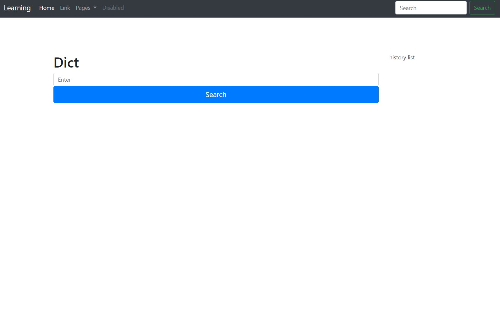

# LearnJapanese

This is a web application which you can query about the meaning of Japanese words. This is a good tool. 



## Technical details

### Running locally

The project repository is based on Flask. So it's easy to launch the app locally on your PC or Mac. Install python3.7+ 

Install dependencies with
```powershell
pip install Flask
pip install beautifulsoup4

py3 run.py
```

## Third party libraries
Besides the frameworks mentioned above, other libraries are used. Here is the short list:

* Flask
* BeautifulSoup

Many thanks to all these libraries' authors and contributors. 
